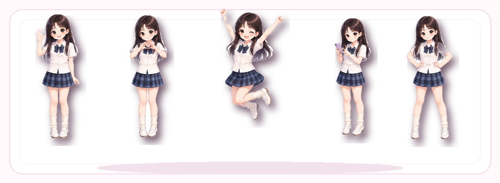

<!-- Profile README for yoona333 -->

<h1>Hi, I'm Yoona</h1>

  <strong>Smart Contract Developer | Frontend Developer | Full-stack Builder</strong>

  Building Web3 products from contract logic to polished, human-friendly interfaces.

  
  
  
  
  
  

---

## About Me

I am a growth-oriented Web3 full-stack developer exploring the space between smart contracts, frontend experiences, and practical product logic. I like building small but complete things, learning through demos, and making technical ideas feel clear enough to use.

- I enjoy turning contract logic into usable product flows.
- I care about clean interfaces, readable code, and steady iteration.
- I am currently practicing Solidity, TypeScript, React, Next.js, Ethers, Wagmi, and Hardhat.
- My goal is to ship useful Web3 products with a soft visual style and a reliable engineering core.

---

## Current Focus

- **Smart Contracts:** clear Solidity patterns, contract testing, and wallet integration.
- **Frontend:** React and Next.js interfaces that feel simple, calm, and practical.
- **Full-stack:** product flow from API design to state management and UI polish.

---

## Tech Stack

  

  
  
  

---

## GitHub Activity

  
  

---

## Connect

  
  
  

Soft visuals, steady commits, and products that feel a little more human.

